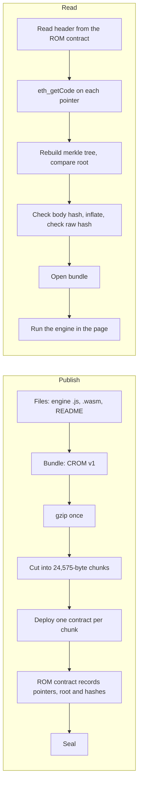

# How chainrom works

chainrom stores a complete program on an EVM chain and runs it in a browser. The program is
not fetched from a server. The page reads it out of contract code on Robinhood Chain (id 4663),
proves it is the program that was published, and only then executes it.

The website contains no game. It contains a reader. This document describes both halves:
how a program gets onto the chain, and what the reader does to get it back out.

## Overview

The two halves meet at the chain: what Publish writes is exactly what Read fetches.

## Publishing a program

1. **Bundle.** The engine and its data files are packed into one container (`js/bundle.mjs`).
2. **Compress.** The whole bundle is gzipped once. Compressing the bundle rather than each
   file gives a smaller result and lets the on-chain hashes commit to exactly the stored bytes.
3. **Chunk.** The compressed bytes are cut into pieces of at most **24,575 bytes**. The EVM
   limits deployed code to 24,576 bytes (EIP-170), and one byte of that budget is used by the
   STOP prefix described below.
4. **Commit.** A keccak256 merkle tree is built over the chunk hashes. keccak256 is used
   because the EVM computes it natively, so a contract can check a proof cheaply.
5. **Deploy.** Each chunk becomes its own small contract whose code is `0x00` followed by the
   chunk. The leading `0x00` is the STOP opcode, so the data can never execute if called.
6. **Record and seal.** The ROM contract stores the ordered list of chunk-contract addresses,
   the merkle root, the hash of the compressed body, the hash of the inflated payload, and the
   inflated length. Sealing is one-way: afterwards the root can no longer change.

The publisher and packer that perform these steps are not in the public repository. See
[Limits](#limits).

## Reading a program back

This is what `js/load.mjs` does, in order. Nothing is executed until every check has passed.

1. **Read the header** from the ROM contract: chunk count, root, body hash, raw hash, raw
   length, and whether it is sealed. An unsealed ROM is refused, because its owner could still
   change the root, so a match would prove only that the publisher was consistent at that moment.
2. **Read the pointers**: the address of each chunk contract, in order.
3. **Fetch each chunk** with `eth_getCode` on its pointer and drop the leading `0x00`.
4. **Rebuild the merkle tree** from what actually arrived and compare its root with the ROM's.
   A wrong, swapped, missing or duplicated chunk fails here.
5. **Check the body hash** of the concatenated chunks.
6. **Inflate** with the platform's gzip and **check the raw hash** and length. Both the
   compressed and inflated forms are committed to, because a stream can inflate cleanly and
   still be the wrong program.
7. **Open the bundle**, then compile and run the engine (`js/boot.mjs`, `js/emscripten.mjs`).

The reader treats the RPC node as untrusted: the checks above hold whichever endpoint answered.
The page does execute JavaScript that came from the chain. That is only defensible because the
bytes have already matched the sealed root.

## Data formats

### ROM contract interface

The reader calls these functions. Selectors are derived from the signatures, never hard-coded.

| Signature | Meaning |
|-----------|---------|
| `chunkCount()` | Number of chunk contracts |
| `chunks(uint256)` | Address of chunk contract `i` |
| `root()` | keccak256 merkle root over the chunk hashes |
| `bodyHash()` | keccak256 of the concatenated chunks (the gzip stream) |
| `rawHash()` | keccak256 of the inflated payload (the bundle) |
| `rawBytes()` | Length of the inflated payload |
| `sealed_()` | Whether the root is final |

### Merkle tree

Leaves are `keccak256(chunk)`. A parent is `keccak256(left ‖ right)`. When a level has an odd
number of nodes, the last one is promoted unchanged rather than paired with itself. The
implementation is `js/merkle.mjs`.

### Bundle (`CROM`, version 1)

All integers are big-endian.

| Field | Size | Notes |
|-------|------|-------|
| Magic | 4 bytes | `CROM` (`43 52 4f 4d`) |
| Version | 1 byte | `1` |
| File count | 4 bytes | Must not be zero |
| Directory | per file | name length (2 bytes), name (UTF-8), size (4 bytes) |
| File data | per file | The files' bytes, back to back, in directory order |

The parser rejects truncated input, an implausible file count, and a directory that does not
account for every remaining byte. The implementation is `js/bundle.mjs`.

## What is on chain today

Captured 2026-09-19 at block 67206628 and re-checked by `npm run verify:online`.

| ROM | Address | Chunks | Compressed | Inflated | Files |
|-----|---------|--------|-----------|----------|-------|
| DEPTH | `0x5b2ed277…e931` | 10 | 222,097 B | 794,117 B | `README.txt`, `depth.js`, `depth.wasm` |
| SIEGE | `0x16f5c165…1b4a` | 10 | 222,828 B | 798,811 B | `README.txt`, `arena.js`, `arena.wasm` |
| DRIFT | `0xd1054cea…31fc` | 10 | 225,583 B | 801,358 B | `README.txt`, `drift.js`, `drift.wasm` |
| README ROM | `0xaaa063de…6591` | 1 | 959 B | 1,129 B | `data/README.txt`, `data/palette`, `engine.wasm` |

Full addresses, merkle roots, every chunk's contract address, size and hashes are in
`data/manifest.json`. The files inside each ROM are in `data/extracted/<id>/`.
DEPTH, SIEGE and DRIFT are emscripten builds: a `.js` runtime plus a `.wasm` module, both stored
on chain. The README ROM is a 160-byte module that its own README describes as an emitted XOR-field demo.

## Captures

Full-page captures of the live site on 2026-09-19 are in `docs/captures/2026-09-19/`. A byte-exact
copy of everything the browser receives, with response headers, is in `snapshots/`.

| File | Shows |
|------|-------|
| `index-idle.png`, `index.pdf` | The main page before anything is loaded |
| `index-depth-booted.png` | DEPTH loaded from chain, verification log and game running |
| `index-siege-booted.png` | SIEGE, same |
| `index-drift-booted.png` | DRIFT, same |
| `battleship.png`, `battleship.pdf` | The BATTLESHIP page and its play wallet |

## Limits

- **Engine source is not published.** The on-chain READMEs cite `engine-src/maze.c` and
  `engine-src/arena.c`. The public repository holds only the reader. The compiled `.js` and
  `.wasm` are archived here, so the games can be run and studied, but they cannot be rebuilt or
  changed from this repository alone.
- **Publisher, packer and tests are not published.** The site describes them and mentions 207
  tests. None of that is in the public repository. A successor would have to reimplement the
  publishing side from the formats above; the read side and the formats are fully specified.
- **BATTLESHIP's referee is captured as bytecode only.** Its behaviour is described by the
  upstream page and commit history; it has not been analysed here.
- **The chain is the single copy of the game bytes** apart from this archive. If the chain
  stopped serving them, this archive would be the remaining source.
